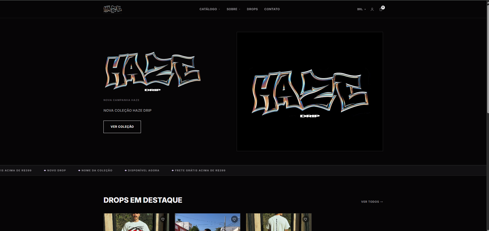
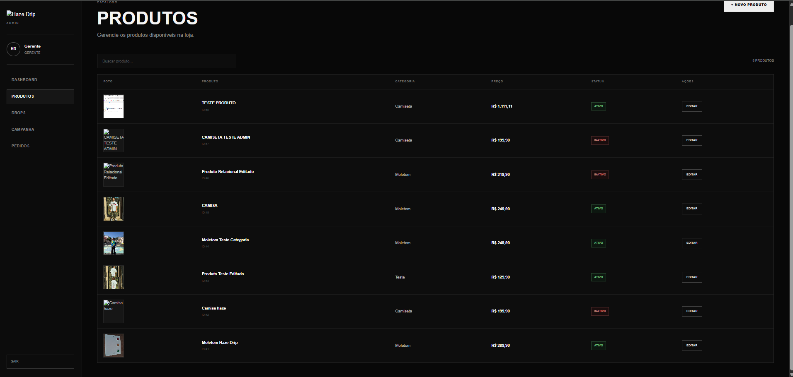
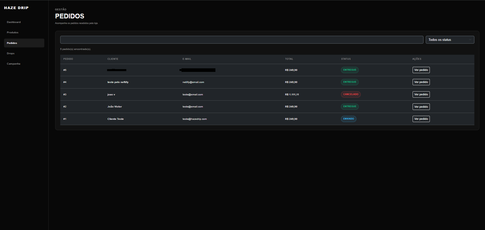

# Haze Drip — E-commerce Full Stack

E-commerce de streetwear desenvolvido do zero: loja virtual, área do cliente, checkout com Mercado Pago, painel administrativo, API REST com regras de negócio, controle de estoque transacional e relatórios.

O projeto foi criado para aplicar na prática conhecimentos da minha formação em **Sistemas de Informação** e dos meus estudos em desenvolvimento web.

> 🚀 **Status:** versão 2.0, com o fluxo completo de compra, pagamento, entrega e gestão da loja.

## 🌐 Demonstração

**Loja:** https://6a9ed0deee28f68217553dad--ubiquitous-squirrel-39e709.netlify.app/hazedrip/frontend/

**Painel administrativo:** tem autenticação própria; as credenciais não são públicas.

## ✨ Funcionalidades

### Loja e cliente
- Catálogo com busca, filtros (categoria, tamanho, cor, preço, promoção, estoque), ordenação e paginação
- Página de produto com galeria, variações, avaliações de compra verificada e produtos relacionados
- Sacola salva na conta e sincronizada entre dispositivos, com conferência de preço e estoque
- Cadastro, login com renovação automática de sessão, confirmação de e-mail e recuperação de senha
- Endereços salvos, "Meus pedidos" com rastreio e linha do tempo do pedido
- LGPD: download dos dados e exclusão da conta

### Checkout e pagamentos
- Frete por tabela (faixa de CEP, estado ou padrão), prazo e frete grátis acima de um valor
- Cupons (percentual, valor fixo, frete grátis) com validade e limites de uso
- Promoções por campanha com período e desconto automáticos
- **Mercado Pago:** PIX com QR Code na própria loja ou cartão/boleto pelo Checkout Pro
- Webhook com verificação de assinatura, conferência do valor pago e expiração automática
- Proteção contra pedido duplicado (chave de idempotência)

### Painel administrativo
- Dashboard: faturamento, ticket médio, conversão, cancelamentos, clientes e gráfico de vendas
- Produtos, fotos (Cloudinary), variações, categorias, destaques e campanha da Home
- Estoque: inventário, entrada, ajuste, estoque mínimo e histórico de movimentações
- Pedidos: fluxo de status, rastreio, cancelamento e reembolso total ou parcial
- Clientes (com bloqueio), cupons, frete, moderação de avaliações
- Relatórios em CSV, usuários com perfis (gerente/operador) e auditoria das ações

### Qualidade e segurança
- **71 testes automatizados** de API (pedidos simultâneos, estoque, pagamentos, permissões), rodando contra MySQL 8 no GitHub Actions
- Senhas com bcrypt, JWT com sessões revogáveis, limite de tentativas, Helmet, CORS restrito
- Proteção contra XSS e SQL Injection, validação centralizada, logs estruturados

## 🧱 Regras de negócio que valem destacar

- **Estoque sem venda dupla:** a criação do pedido trava as variações (`SELECT ... FOR UPDATE`) em ordem fixa e só baixa o estoque com `estoque >= quantidade`. Os testes disparam pedidos simultâneos pela última unidade.
- **Preço do servidor:** valores enviados pelo navegador são ignorados. Preço, promoção, cupom e frete são recalculados no banco.
- **Tudo ou nada:** pedido, itens, baixa de estoque, uso do cupom e histórico ficam na mesma transação.
- **Pagamento confiável:** o webhook não é usado como fonte de verdade. A API consulta o pagamento no Mercado Pago e compara o valor pago com o total.

```text
Aguardando pagamento → Pago → Em preparação → Enviado → Entregue
        │                │           │
        └────────────────┴───────────┴──→ Cancelado (devolve estoque e cupom; reembolso opcional)
```

## 🛠️ Tecnologias

| Camada | Tecnologias |
|---|---|
| Frontend | HTML5, CSS3, JavaScript (sem framework), Bootstrap no painel |
| Backend | Node.js, Express 5, JWT, bcrypt, Multer, Helmet |
| Banco | MySQL 8 (transações, índices, migrações versionadas) |
| Serviços | Mercado Pago, Cloudinary, Resend, ViaCEP |
| Infra | Railway (API e banco), Netlify (loja e painel), GitHub Actions (CI) |
| Testes | `node:test` + `fetch` contra banco real |

## 🗂️ Estrutura

```text
HAZE-DRIP/
├── frontend/            Loja (catálogo, produto, sacola, checkout, conta, páginas legais)
├── admin/               Painel administrativo
├── backend/
│   ├── server.js        Inicia o servidor e a expiração de pedidos
│   ├── src/
│   │   ├── app.js       Middlewares e rotas
│   │   ├── config/      Ambiente, banco, Cloudinary
│   │   ├── routes/      loja/ e admin/ (camada HTTP)
│   │   ├── services/    Regras de negócio e SQL
│   │   ├── middlewares/ Autenticação, limites, upload, auditoria, erros
│   │   ├── integracoes/ Mercado Pago
│   │   ├── emails/      Modelos de e-mail
│   │   └── utils/       Validação, transações, logs, eventos
│   ├── migrations/      Esquema do banco versionado
│   └── tests/           Testes de API
├── docs/                API, deploy e checklist de produção
└── assets/              Logo
```

## ▶️ Executando localmente

```bash
git clone https://github.com/bonfimgit/HAZE-DRIP
cd HAZE-DRIP/backend
cp .env.example .env        # configure o MySQL e o JWT_SECRET
npm install
npm run migrate             # cria/atualiza o banco
node criar-admin.js "SenhaForte123"
npm start                   # API em http://localhost:3000
```

Sirva a raiz do repositório na porta 5500 (Live Server ou `python3 -m http.server 5500`) e acesse `http://127.0.0.1:5500/frontend/`. Em `localhost`, a loja e o painel usam a API local automaticamente.

Testes: `npm test` (veja as variáveis `TEST_DB_*` em [docs/DEPLOY.md](docs/DEPLOY.md#9-desenvolvimento-local)).

## 📚 Documentação

- [Referência da API](docs/API.md): 104 rotas
- [Deploy e operação](docs/DEPLOY.md): variáveis, migrações, Mercado Pago, e-mails, backup e monitoramento
- [Checklist de produção](docs/PRODUCAO.md)

## 🔐 Segurança

Informações sensíveis ficam em variáveis de ambiente e nunca no repositório (`.env`, uploads e arquivos SQL estão no `.gitignore`). Modelo das variáveis: [`backend/.env.example`](backend/.env.example).

## 📸 Screenshots

### Loja — Página inicial


### Painel administrativo — Produtos


### Painel administrativo — Pedidos


## 🎓 Objetivo acadêmico e profissional

Este projeto faz parte da minha formação em Sistemas de Informação e desenvolvimento Full Stack. A Haze Drip foi usada para praticar desenvolvimento frontend, APIs REST, modelagem de banco de dados, autenticação, regras de negócio, controle de estoque, transações e concorrência, integração com pagamentos, testes automatizados, Git e deploy.

## 👨‍💻 Autor

**João Victor Silva Bonfim Santos**

Estudante de **Sistemas de Informação** e desenvolvedor Full Stack em formação. Estou buscando minha primeira oportunidade profissional na área de desenvolvimento de software, onde possa continuar evoluindo e contribuir com projetos reais.

**Áreas de interesse:** desenvolvimento Full Stack e Backend, Node.js, JavaScript, APIs REST, banco de dados e desenvolvimento web.

📍 Passos — MG, Brasil
